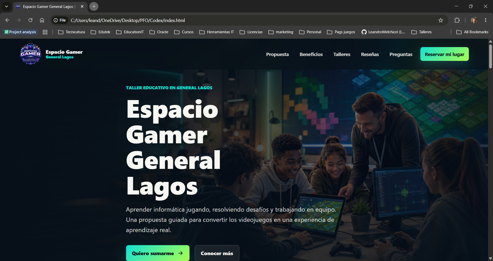
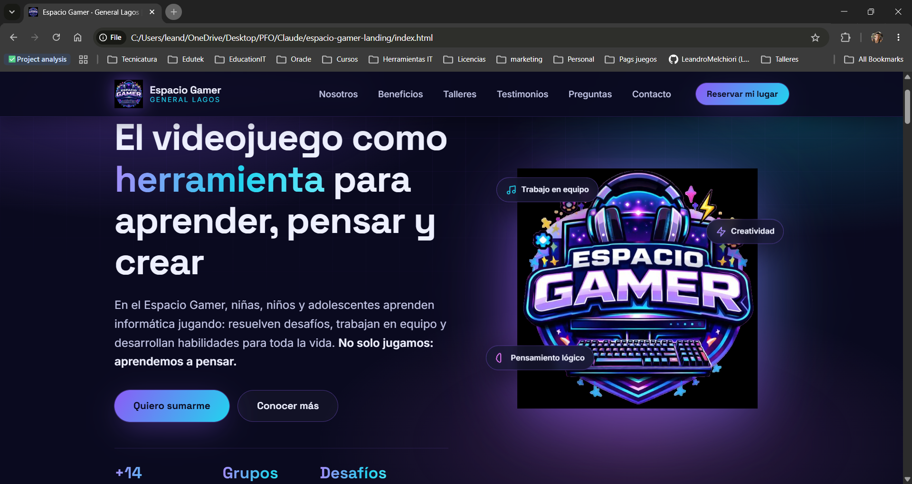

# PFO2 - Despliegue unificado

Repositorio para la Practica Formativa Obligatoria 2 sobre Prompt Engineering en agentes de IA.

## Datos del estudiante

- Estudiante: Leandro Sacha Melchiori
- DNI: 39121517
- Curso: 2do ano
- Comision: D
- Fecha de entrega: 26/06/2026

## Deploy unificado

- Link al deploy: https://vercel.com/leandromelchioris-projects/pfo-landing-page

El despliegue inicia en `index.html`, que funciona como portada de acceso a las tres opciones solicitadas por la consigna.

## Accesos incluidos

1. Prompt utilizado: `prompt.txt`
2. Landing generada por Codex: `Codex/index.html`
3. Landing generada por Claude Code: `Claude/espacio-gamer-landing/index.html`

## Agentes utilizados

- Primer agente: Codex (OpenAI). Modelo: GPT-5.5 con razonamiento alto.
- Segundo agente: Claude Code. Modelo: Sonnet 4.8 con razonamiento alto.

## Capturas de pantalla

### Landing generada con Codex



### Landing generada con Claude Code



## Prompt exacto utilizado

```text
<role>

Actua como un desarrollador Frontend Senior especializado en UX/UI, diseno web moderno, accesibilidad, marketing digital, diseno responsive y creacion de Landing Pages orientadas a conversion.

Tu tarea es generar una Landing Page profesional, moderna y completamente responsive para promocionar un taller educativo.

Debes tomar decisiones de diseno y desarrollo de manera autonoma, aplicando buenas practicas de codigo, experiencia de usuario, accesibilidad y comunicacion visual.

</role>

<context>

El proyecto corresponde al **Espacio Gamer de General Lagos**, un taller donde ninos y adolescentes aprenden informatica a traves de videojuegos y desafios interactivos.

El objetivo del taller no es simplemente jugar videojuegos, sino utilizar el juego como herramienta educativa para estimular el desarrollo cognitivo, social y emocional.

En los talleres se trabajan actividades con juegos individuales y cooperativos que proponen desafios progresivos. Estos desafios buscan desarrollar habilidades como:

* pensamiento logico
* resolucion de problemas
* creatividad
* memoria
* atencion
* toma de decisiones
* trabajo en equipo
* companerismo
* comunicacion asertiva
* cooperacion
* liderazgo
* tolerancia a la frustracion
* perseverancia
* planificacion estrategica
* adaptacion frente a nuevos desafios

La propuesta debe transmitir que los videojuegos pueden ser una herramienta seria, educativa y motivadora cuando estan bien guiados.

</context>

<visual_identity>

La imagen adjunta corresponde al **logo oficial del Espacio Gamer**.

Debes utilizar esa imagen como logotipo principal de la Landing Page.

La identidad visual del sitio debe construirse tomando como referencia los colores, estilo y energia visual del logo.

La estetica general debe comunicar:

* tecnologia
* videojuegos
* educacion
* innovacion
* diversion
* confianza
* profesionalismo

Evitar que el sitio parezca demasiado infantil. Debe resultar atractivo para ninos y adolescentes, pero tambien generar confianza en padres, madres y adultos responsables.

</visual_identity>

<target_audience>

El publico objetivo principal son padres, madres y adultos responsables de ninos y adolescentes de General Lagos y alrededores.

El publico secundario son ninos y adolescentes interesados en videojuegos, informatica, tecnologia y desafios interactivos.

El lenguaje debe ser claro, cercano, motivador y profesional.

Debe transmitir entusiasmo, pero sin sonar exagerado ni publicitario de forma generica.

</target_audience>

<main_objective>

Crear una Landing Page cuyo objetivo principal sea invitar a las familias a sumarse a los talleres del Espacio Gamer.

La pagina debe motivar al visitante a solicitar informacion o inscribirse.

El llamado a la accion principal debe repetirse en puntos estrategicos del sitio.

Usar CTAs como:

* Quiero sumarme
* Reservar mi lugar
* Solicitar informacion
* Inscribirme al taller
* Conocer mas

</main_objective>

<page_structure>

La Landing Page debe incluir obligatoriamente las siguientes secciones:

## 1. Header

Crear una cabecera moderna con:

* logo oficial del Espacio Gamer
* menu de navegacion
* boton CTA visible
* navegacion suave hacia las secciones internas
* diseno responsive para dispositivos moviles

## 2. Hero Section

Crear una seccion principal impactante con:

* titulo fuerte y atractivo
* subtitulo explicando la propuesta educativa
* boton CTA principal
* imagen, ilustracion, fondo o recurso visual relacionado con videojuegos, tecnologia e informatica
* diseno visual llamativo, moderno y profesional

El mensaje central debe dejar claro que en el Espacio Gamer se aprende informatica jugando, resolviendo desafios y trabajando en equipo.

## 3. Sobre Nosotros

Explicar que es el Espacio Gamer de General Lagos.

Aclarar que el taller combina videojuegos, informatica y desarrollo de habilidades cognitivas.

Transmitir que los juegos son seleccionados y utilizados con una finalidad educativa.

## 4. Beneficios o Caracteristicas Principales

Crear una seccion con tarjetas visuales e iconos modernos.

Incluir beneficios como:

* Desarrollo del pensamiento logico
* Resolucion de problemas
* Trabajo en equipo
* Comunicacion asertiva
* Creatividad
* Concentracion
* Tolerancia a la frustracion
* Cooperacion
* Aprendizaje a traves de desafios

## 5. Como son los talleres?

Explicar la dinamica de las clases:

* desafios individuales
* desafios cooperativos
* juegos seleccionados con objetivos educativos
* actividades guiadas
* resolucion de problemas
* reflexion sobre lo aprendido
* acompanamiento durante el proceso

Debe quedar claro que el aprendizaje se produce de forma practica, entretenida y progresiva.

## 6. Testimonios o Resenas

Crear al menos cuatro testimonios ficticios, realistas y breves.

Los testimonios deben representar opiniones de padres, madres o participantes.

Deben transmitir confianza, entusiasmo y mejora en habilidades personales.

## 7. Preguntas Frecuentes

Agregar una seccion de preguntas frecuentes con respuestas claras.

Incluir preguntas como:

* Necesitan conocimientos previos?
* Que edades pueden participar?
* Que tipo de juegos se utilizan?
* Se aprende informatica?
* Los talleres son solo para quienes ya juegan videojuegos?
* Donde se realizan?

## 8. Formulario de Contacto

Crear un formulario visual, sin funcionalidad backend real.

El formulario debe incluir:

* Nombre del adulto responsable
* Nombre del alumno/a
* Edad del alumno/a
* Telefono
* Email
* Mensaje opcional
* Boton CTA: "Quiero mas informacion"

## 9. Footer

Crear un pie de pagina con:

* logo o nombre del Espacio Gamer
* enlaces de navegacion
* redes sociales ficticias o placeholders
* ubicacion: General Lagos, Santa Fe
* copyright

</page_structure>

<design_requirements>

El diseno debe ser:

* moderno
* responsive
* visualmente atractivo
* profesional
* accesible
* limpio
* dinamico
* tecnologico
* orientado a conversion

Aplicar:

* buena jerarquia visual
* tipografias modernas y legibles
* contraste adecuado
* botones claros
* tarjetas con bordes redondeados
* sombras sutiles
* animaciones suaves
* diseno adaptable a celular, tablet y escritorio
* iconografia coherente
* espaciado equilibrado

La estetica puede inspirarse en Landing Pages modernas de tecnologia, educacion digital, videojuegos y productos SaaS.

</design_requirements>

<technical_requirements>

Generar el proyecto completo de la Landing Page utilizando tecnologias frontend modernas.

Priorizar codigo limpio, organizado, mantenible y facil de entender.

El sitio debe funcionar correctamente sin necesidad de backend.

No incluir dependencias innecesarias.

Cuidar:

* accesibilidad semantica
* etiquetas HTML correctas
* textos alternativos en imagenes
* buen rendimiento
* diseno mobile-first
* estructura clara de archivos
* nombres descriptivos de clases, componentes o secciones

Si utilizas React, Next.js, Vite u otro framework, organizar el proyecto correctamente.

Si utilizas HTML, CSS y JavaScript puro, separar los archivos de manera ordenada.

</technical_requirements>

<content_tone>

El tono del contenido debe ser:

* cercano
* profesional
* motivador
* claro
* confiable
* moderno

Evitar frases vacias o genericas.

No presentar el taller como una simple actividad recreativa.

Comunicar que el juego es una herramienta para aprender, pensar, crear, cooperar y superar desafios.

</content_tone>

<success_criteria>

Antes de finalizar, verifica que la Landing Page cumpla con estos criterios:

* Usa el logo oficial adjunto como identidad principal.
* Tiene Header con navegacion.
* Tiene Hero Section con CTA claro.
* Explica que es el Espacio Gamer.
* Comunica el valor educativo de aprender informatica mediante videojuegos.
* Incluye beneficios concretos.
* Incluye seccion de dinamica de clases.
* Incluye testimonios o resenas.
* Incluye formulario de contacto visual.
* Incluye Footer con redes sociales.
* Es responsive.
* Tiene una estetica moderna y tecnologica.
* Resulta atractiva para ninos y adolescentes.
* Genera confianza en padres y madres.
* Esta orientada a conseguir inscripciones o consultas.

</success_criteria>

<final_instruction>

Genera la Landing Page completa de forma autonoma.

No pidas confirmaciones adicionales.

No entregues solo una explicacion: crea directamente los archivos necesarios del proyecto.

</final_instruction>
```

## Estructura

```text
PFO/
|-- index.html
|-- styles.css
|-- prompt.txt
|-- README.md
|-- screenshots/
|   |-- landing-codex.png
|   `-- landing-claude-code.png
|-- Codex/
|   |-- index.html
|   |-- styles.css
|   |-- script.js
|   `-- assets/
`-- Claude/
    `-- espacio-gamer-landing/
        |-- index.html
        |-- css/
        |-- js/
        `-- assets/
```
